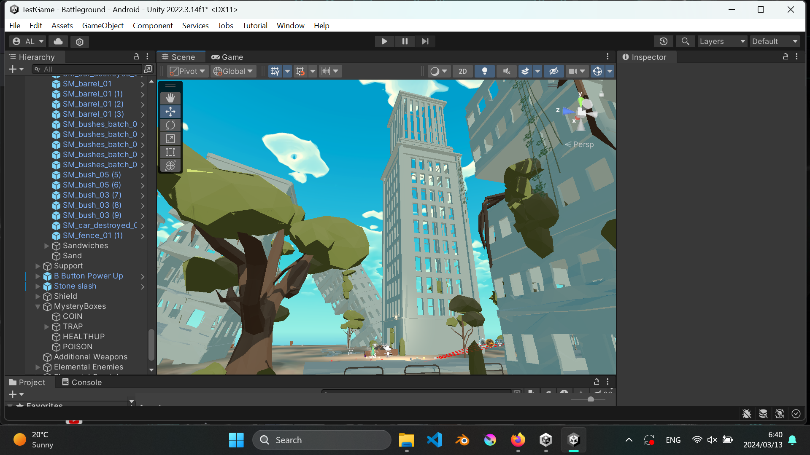
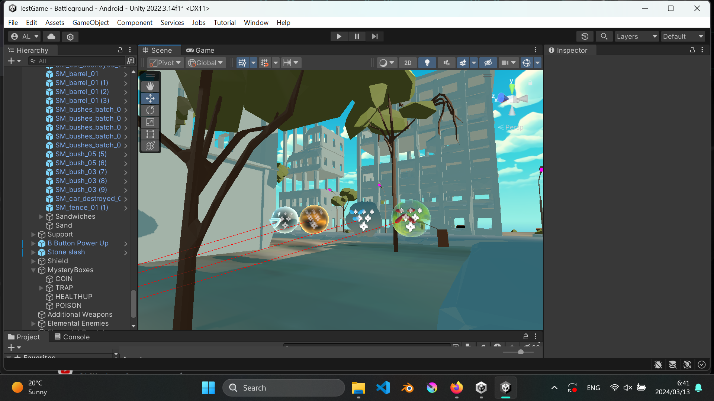
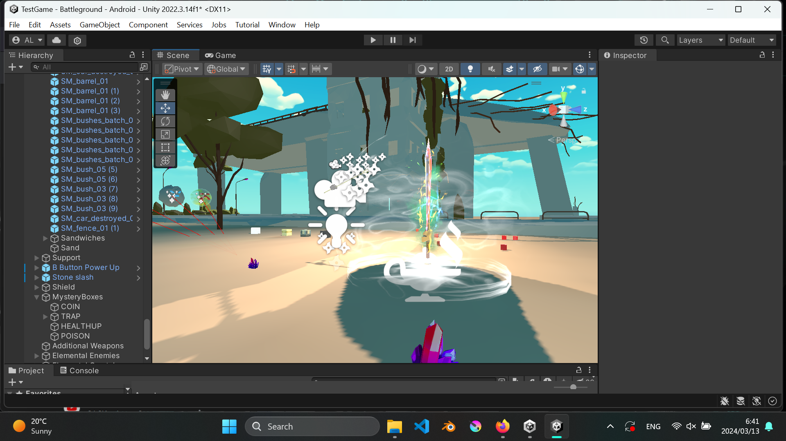

# Elemental VR Game (WIP)

Independently developed a VR game in Unity Game Engine for Oculus Quest 2. Character controls a wand to attack enemies and cast spells by drawing
hand motions with VR controllers, and placing correct numbers of collectable items into portals to trigger a boss-level fight. Work in progress 
for spell casting functionality by capturing drawn hand motions and boss combat mechanics.

## Sample shots

See the images folder for sample shots.

